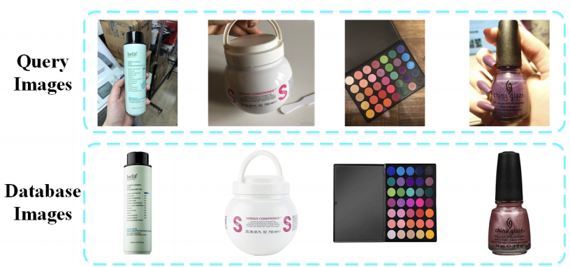

###  AI Meets Beauty Challenge
#### ACM Multimedia 2018
Perfect Half Million Beauty Product Image Recognition Challenge at ACM Multimedia 2018 [Link](https://challenge2018.perfectcorp.com)



Repo contains the scripts used for downloading the dataset and evaluation of our submission for the challenge [Team: VCA]

#### Code Structure
```bash
.
├── caffe-prototxt              # Prototxt file for caffe model using inception-v1
├── dataset                     # test images urls and labels
├── scripts                     # scripts for evaluation on testset
├── utils                       # Helper code for retrieval and testing scripts
└── README.md
```


#### Usage
* Download the whole retrieval dataset consisting of 500K images in dataset folder
```
$ python crawl.py 0
```
* Download [Validation Set](http://s3.bj.bcebos.com/challenge2018/public_testset/val.zip), [Validation Ground Truth](http://s3.bj.bcebos.com/challenge2018/public_testset/val.csv) and [Testset](http://s3.bj.bcebos.com/challenge2018/public_testset/testset_v1.zip)

* Modify testbed.cfg file with location of dataset and caffe prototxt and run the following command to evaluate (Model weights are not shared)
```
$ python -u testbed.py --p deploy.caffemodel -i 0 | tee log.txt
```
